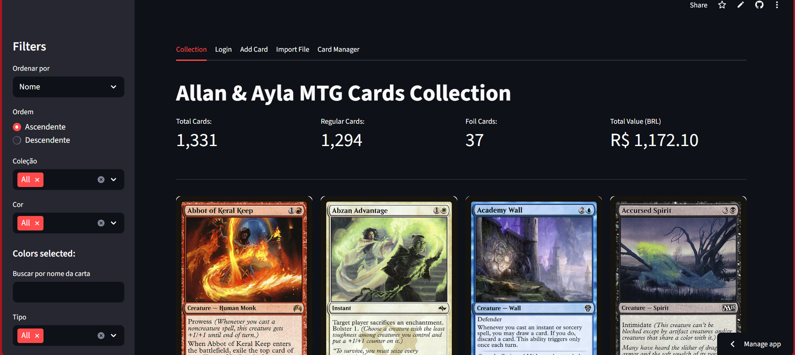
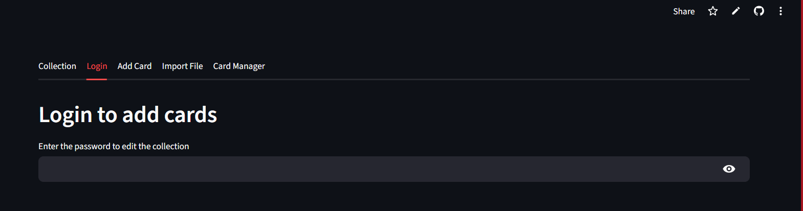
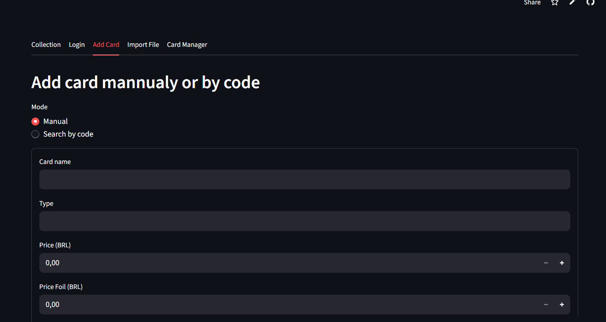
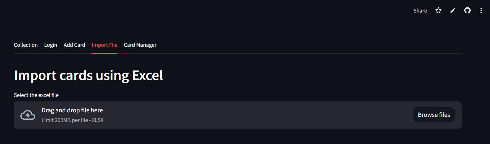
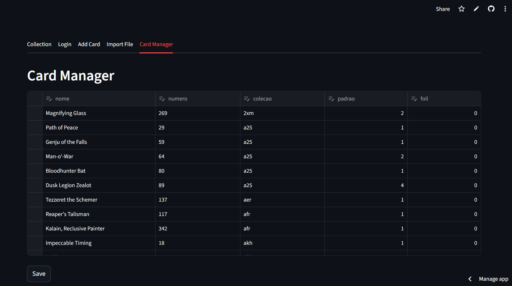

# Project 2 - MTG cards price via Scryfall API

Link: https://allan-and-ayla-mtg-card-collection.streamlit.app/

This Streamlit app helps users upload Magic: The Gathering card data from Excel files, fetch detailed card information via the Scryfall API, and store the enriched dataset in a GitHub repository for versioned tracking.

How It Works – Step by Step
1. Upload Excel File or add cards mannualy
Users upload an .xlsx file containing a list of Magic cards. The app reads the file using pandas.read_excel().
2. Extract Card Names 
The app parses the card names from the uploaded file and prepares them for API requests.
3. Fetch Card Details via Scryfall API 
For each card, the app queries the Scryfall API to retrieve:
- Card image
- Set name
- Rarity
- Price in USD
- Collector number and other metadata
4. Display Cards in Streamlit 
The enriched card data is displayed in a visually friendly format using Streamlit components, including images and formatted text.
5. Save to GitHub (Incremental Update) 
The app saves the final dataset to a CSV file in a GitHub repository:
- If the file doesn’t exist, it creates it.
- If the file already exists, it appends new data to the existing CSV and updates the file using the GitHub API with the correct sha.
6. Version Control via GitHub 
Each update is committed with a message, allowing users to track changes over time in the GitHub commit history.

Technologies Used
Streamlit – UI and interactivity
Pandas – Data manipulation
Scryfall API – Card metadata and pricing
GitHub API – Remote CSV storage and versioning
Base64 & Requests – Encoding and HTTP communication

Page 1:

Page 2:

Page 3:

Page 4:

Page 5:

