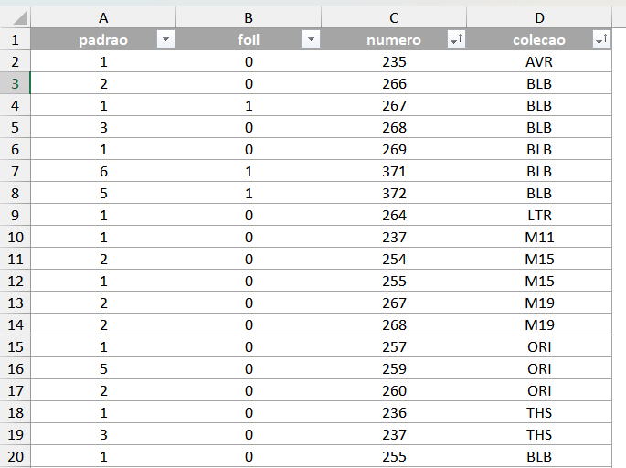

# Project 2 - MTG cards price via Scryfall API

This project aims to extract the price (and other data) of magic cards from an Excel file using the Scryfall platform API and then convert the values to dollars. In a future stage, this data will be displayed in some way.

1. Create a list with the numeric codes of each card, the collection code, and the quantity of each card you have.
> If the card is promotional or a token, pay attention to the correct naming of the code.

2. The script [card_data.py](card_data.py) will look for the data of each card and add it to the columns to the right of those that already exist in a new file and save it in the same location.

3. If any of the search lots return an error, use the script [card_validation.py](card_validation.py) to check which letter has the problem.